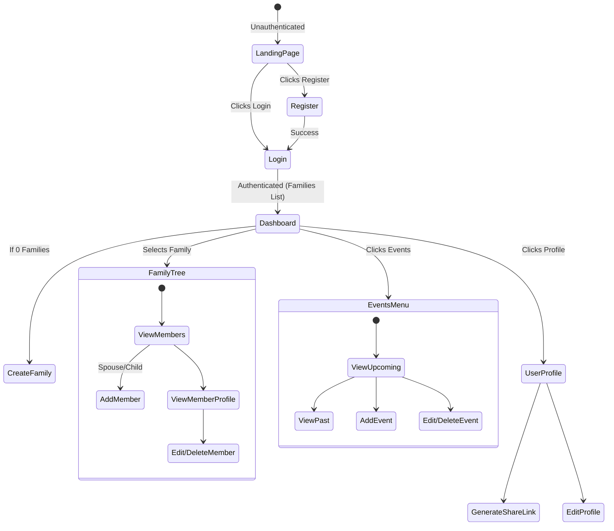

## Application Flow

This illustrates how a user navigates the core features.

```mermaid
stateDiagram-v2
    [*] --> LandingPage : Unauthenticated
    LandingPage --> Login : Clicks Login
    LandingPage --> Register : Clicks Register

    Register --> Login : Success
    Login --> Dashboard : Authenticated (Families List)

    Dashboard --> CreateFamily : If 0 Families
    Dashboard --> FamilyTree : Selects Family

    state FamilyTree {
        [*] --> ViewMembers
        ViewMembers --> AddMember : Spouse/Child
        ViewMembers --> ViewMemberProfile
        ViewMemberProfile --> Edit/DeleteMember
    }

    Dashboard --> EventsMenu : Clicks Events

    state EventsMenu {
        [*] --> ViewUpcoming
        ViewUpcoming --> ViewPast
        ViewUpcoming --> AddEvent
        ViewUpcoming --> Edit/DeleteEvent
    }

    Dashboard --> UserProfile : Clicks Profile
    UserProfile --> GenerateShareLink
    UserProfile --> EditProfile

```