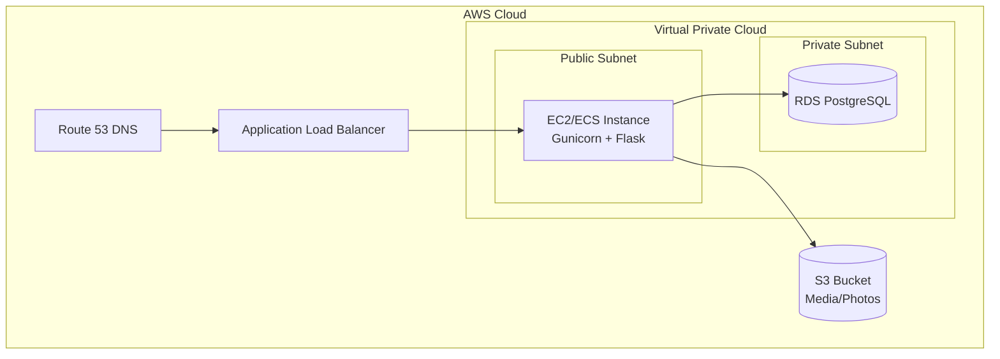

## AWS Deployment Architecture

```mermaid
graph TD
    subgraph AWS_Cloud [AWS Cloud]
        Route53[Route 53 DNS]
        ALB[Application Load Balancer]

        subgraph VPC [Virtual Private Cloud]
            subgraph Public_Subnet [Public Subnet]
                EC2[EC2/ECS Instance<br/>Gunicorn + Flask]
            end

            subgraph Private_Subnet [Private Subnet]
                RDS[(RDS PostgreSQL)]
            end
        end

        S3[(S3 Bucket<br/>Media/Photos)]
    end

    %% Relationships
    Route53 --> ALB
    ALB --> EC2
    EC2 --> RDS
    EC2 --> S3

```