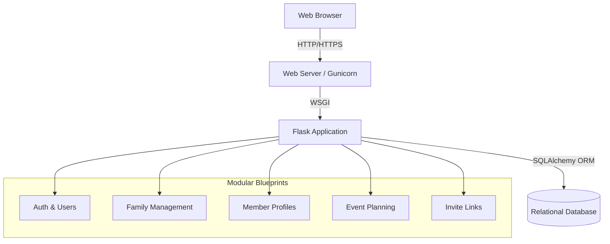

# Lineage Architecture Diagram

**Application Architecture Diagram**

```mermaid
graph TD
    Client[Web Browser]
    Client -->|HTTP/HTTPS| WebServer[Web Server / Gunicorn]
    WebServer -->|WSGI| App[Flask Application]

    subgraph Application Modules [Modular Blueprints]
        Auth[Auth & Users]
        Family[Family Management]
        Member[Member Profiles]
        Event[Event Planning]
        Link[Invite Links]
    end

    App --> Auth
    App --> Family
    App --> Member
    App --> Event
    App --> Link

    App -->|SQLAlchemy ORM| Database[(Relational Database)]
```