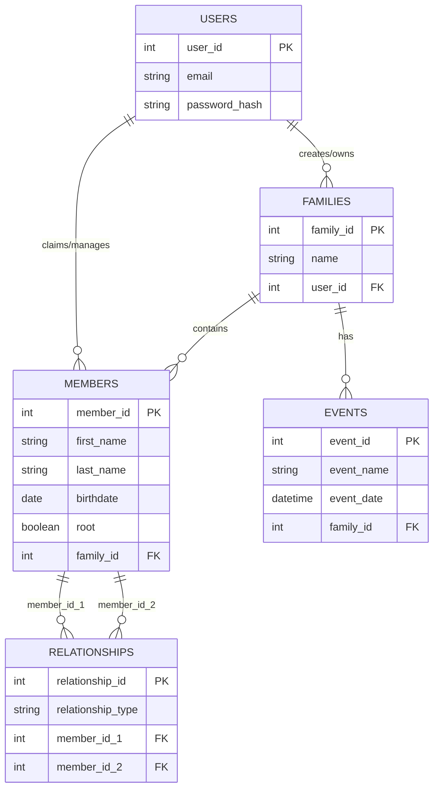

# Lineage Entity Relationship Diagram (ERD)

**Entity Relationship Diagram (ERD)**

```mermaid
erDiagram
    USERS ||--o{ MEMBERS : "claims/manages"
    USERS ||--o{ FAMILIES : "creates/owns"
    FAMILIES ||--o{ MEMBERS : "contains"
    FAMILIES ||--o{ EVENTS : "has"
    MEMBERS ||--o{ RELATIONSHIPS : "member_id_1"
    MEMBERS ||--o{ RELATIONSHIPS : "member_id_2"

    USERS {
        int user_id PK
        string email
        string password_hash
    }
    FAMILIES {
        int family_id PK
        string name
        int user_id FK
    }
    MEMBERS {
        int member_id PK
        string first_name
        string last_name
        date birthdate
        boolean root
        int family_id FK
    }
    EVENTS {
        int event_id PK
        string event_name
        datetime event_date
        int family_id FK
    }
    RELATIONSHIPS {
        int relationship_id PK
        string relationship_type
        int member_id_1 FK
        int member_id_2 FK
    }
```